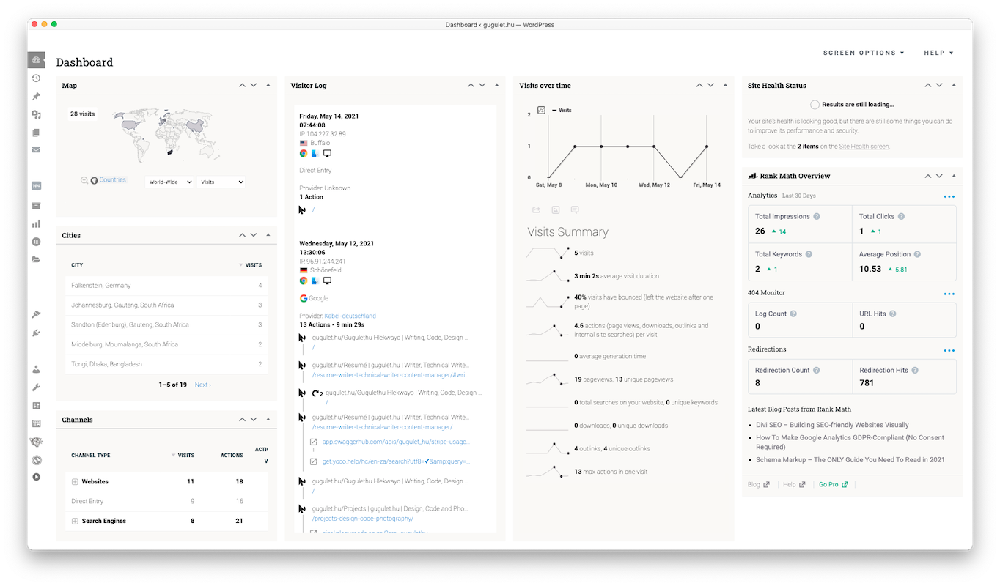

# g-modify

A must-use plugin for wordpress that modifies the wordpress admin area using php snippets. Removes the needs for customising the wordpress config.php file, which gets overwritten every update. These are snippes that I've written and picked up over the years. It is well documented, so copy what you need.

## Install

* Copy and edit the modules you need into a php script.

* Create a directory named `mu-plugins` inside the wp-content directory with permissions set at 755.

* Put your php script inside the folder and it should appear on the Must-Use tab of your Wordpress plugins page.

To disable any section simply comment it out or delete the script. For the matomo sections you will need a matomo analytics install and your own api key from it to [create the widgets](https://matomo.org/docs/embed-matomo-reports/).

## License

All the works are available under the MIT license.

Permission is hereby granted, free of charge, to any person obtaining a copy of this software and associated documentation files (the "Software"), to deal in the Software without restriction, including without limitation the rights to use, copy, modify, merge, publish, distribute, sublicense, and/or sell copies of the Software, and to permit persons to whom the Software is furnished to do so, subject to the following conditions:

The above copyright notice and this permission notice shall be included in all copies or substantial portions of the Software.

THE SOFTWARE IS PROVIDED "AS IS", WITHOUT WARRANTY OF ANY KIND, EXPRESS OR IMPLIED, INCLUDING BUT NOT LIMITED TO THE WARRANTIES OF MERCHANTABILITY, FITNESS FOR A PARTICULAR PURPOSE AND NONINFRINGEMENT. IN NO EVENT SHALL THE AUTHORS OR COPYRIGHT HOLDERS BE LIABLE FOR ANY CLAIM, DAMAGES OR OTHER LIABILITY, WHETHER IN AN ACTION OF CONTRACT, TORT OR OTHERWISE, ARISING FROM, OUT OF OR IN CONNECTION WITH THE SOFTWARE OR THE USE OR OTHER DEALINGS IN THE SOFTWARE.

